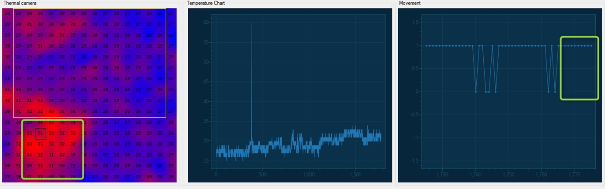

## Data log and visualization
Data log by communication with device then visualization by software development using C# and .NET framework

Real-time data log and visualization take overview how device working, analysis and optimize algorithm implemented on device.

## Data logger software

The software allow user can place the monitor object by select area of retangle. Support component of lable, table, linechart.

Feature:
- Grid change.
- Auto resize object component.
- Add/Remove component.
- Save layout.

Source code: [DataLogger](https://github.com/pnt325/DataLogger)
