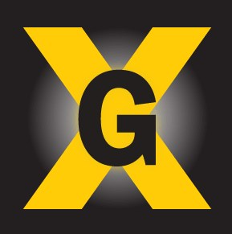
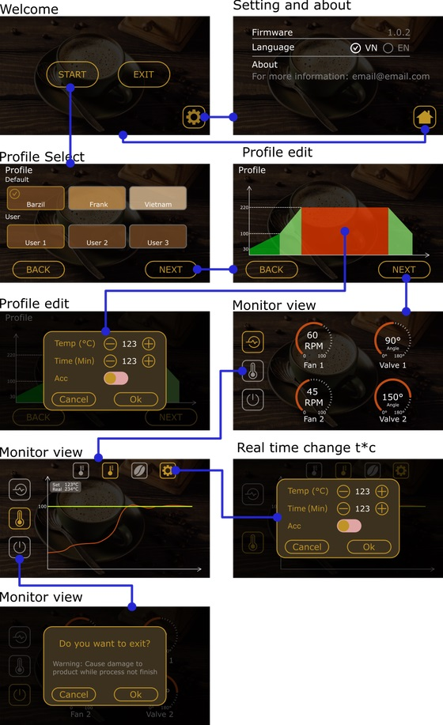
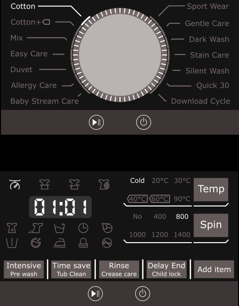
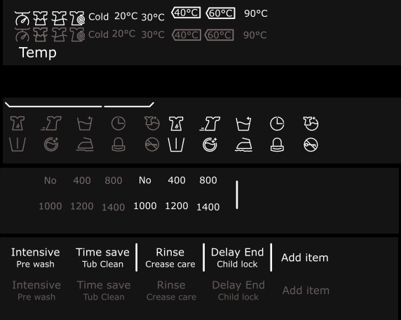
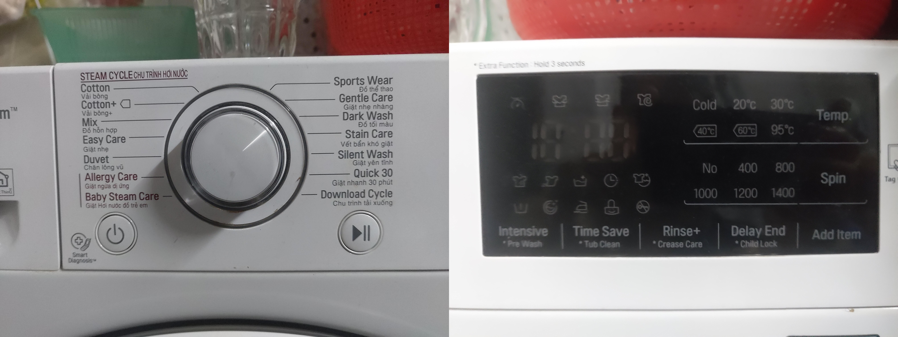

# Embedded GUI application

## Framework 

<table>
  <tr>
    <th>Name</th>
    <th>Details</th>
    <th>Support Tools</th>
  </tr>
  <tr>
    <td><a href="https://support.touchgfx.com/4.20/docs/introduction/welcome">TouchGFX</a></td>
    <td>  </td>
    <td>Yes</td>
  </tr>
  <tr>
    <td> <a href="https://docs.microsoft.com/en-us/azure/rtos/guix/overview-guix">Azure GUIX</a> </td>
    <td> 
  
 </td>
    <td>Yes</td>
  </tr>
</table>

## Project

### 1. Coffee Roasting Machine

The project implement using TouchGFX and STM32F746NG-Disco with custom widget, event.

All the ICON and iamge design by [Inkscape](https://inkscape.org/)

  

### 2. LG Wash Machine Control Panel

#### GUI panel design

##### Icon design

#### Idea

#### Demo

<iframe width="640" height="360" src="https://www.youtube.com/embed/6C_YN7xRSYk" title="Embedded GUI design Wash Machine Touchscreen control panel" frameborder="0" allow="accelerometer; autoplay; clipboard-write; encrypted-media; gyroscope; picture-in-picture" allowfullscreen></iframe>

