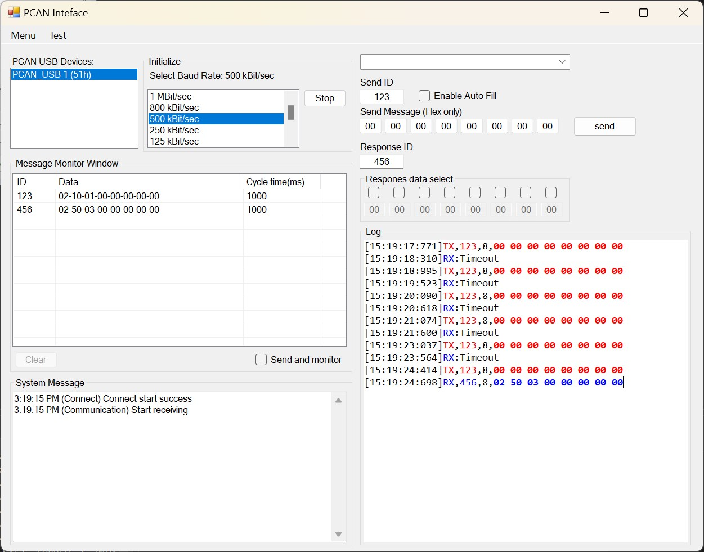

# Introduction

I have 6+ years' experience firmware and software development for IOT device. 

There is experience in embedded firmware/software using C/C++ for almost of popular MCU, SOC, SOM: STM32, NRF52, ESP32, EFM32, EFR32, SAM32, ... And network communication BLE, WIFI, NFC, ETH, USB, CANBUS, MODBUS. Development the mobile app iOS, Android (C# .NET, Xamarin), desktop application Windows, Linux (C#, Python).

Key experiences:
- MCU/SOC/SOM programming C/C++, Debugging, Bug-Fixing.
- Communication protocol: WIFI, ETH, BLE, CAN, MODBUS, NFC, USB(WINUSB, LIBUSB, WCID), Gateway.
- RTOS: freeRTOS, Azure RTOS - threadx, multi tasking/threading, none-blocking.
- Embedded GUI: TouchGFX, Azure GUIX, LVGL.
- Low power consumption.

Quickly analysis and apply open-source project to reduce development period and bring prototype to product.

# Experiences

## 1. Software development

<table>
  <tr>
    <th>OS</th>
    <th>Language</th>
    <th>Details</th>
  </tr>
  <tr>
    <td>Windows</td>
    <td>C#, Python</td>
    <td>Windows Form, WPF, UWP, BLE</td>
  </tr>
  <tr>
    <td>Linux</td>
    <td>C#, Python</td>
    <td>Desktop App, CLI, Services</td>
  </tr>
  <tr>
    <td>Android</td>
    <td>C#</td>
    <td>Xamarin, .NET MAUI, BLE</td>
  </tr>
  <tr>
    <td>iOS</td>
    <td>C#</td>
    <td>Xamarin, .NET MAUI, BLE</td>
  </tr>
</table>

## 2. Embedded GUI

<table>
  <tr>
    <th>Name</th>
    <th>Details</th>
    <th>Support Tools</th>
  </tr>
  <tr>
    <td><a href="https://support.touchgfx.com/4.20/docs/introduction/welcome">TouchGFX</a></td>
    <td>  </td>
    <td>Yes</td>
  </tr>
  <tr>
    <td> <a href="https://docs.microsoft.com/en-us/azure/rtos/guix/overview-guix">Azure GUIX</a> </td>
    <td> 
  
 </td>
    <td>Yes</td>
  </tr>
  <tr>
    <td> <a href="https://lvgl.io/">LVGL</a> </td>
    <td> 
  
 </td>
    <td>Yes</td>
  </tr>
</table>

## 3. Projects

### 3.1 Software development

#### Data Visualization

Real-time visualization data to show device working status, monitoring, data collection to analsys and algorithm optimize

#### [3D Cube & 6 DOF sensor](https://github.com/pnt325/EFR32BG22-Thunerboard-ICM20648-DMP-QUATER_6)

<iframe width="560" height="315" src="https://www.youtube.com/embed/--8RvOhYURk" title="YouTube video player" frameborder="0" allow="accelerometer; autoplay; clipboard-write; encrypted-media; gyroscope; picture-in-picture; web-share" allowfullscreen></iframe>

#### [Data Logger](https://github.com/pnt325/DataLogger)

Monitoring device with able select area of retangle. Support view of table, label, linechart.

Feature:
- Update grid.
- Auto resize component.
- Add/remove component.
- Save/Open layout.

#### CAN bus logging and analyzer software

Communication with [Peak CAN USB](https://www.peak-system.com/PCAN-USB.199.0.html?&L=1)

### 3.2 Low Power Consumption

#### [Power profiler kit](https://www.silabs.com/documents/public/user-guides/ug431-brd4183a-user-guide.pdf)

Kit working with [Energy Profiler](https://docs.silabs.com/simplicity-studio-5-users-guide/1.0/using-the-tools/energy-profiler/) integrated in Simplicity Studio

<iframe width="640" height="360" src="https://www.youtube.com/embed/OZZQ3ALdSR8" title="[Power profiler] IOT device low power consumption" frameborder="0" allow="accelerometer; autoplay; clipboard-write; encrypted-media; gyroscope; picture-in-picture" allowfullscreen></iframe>

### 3.3 Embedded Graphic

#### 1. Coffee Roasting Machine

The project used TouchGFX framework and STM32F746NG-Disco and create custom widget, event.

Icons and image design by [Inkscape](https://inkscape.org/)

  

#### 2. LG Wash Machine Control Panel

##### GUI panel design

##### Icon design

##### Concept

##### Demo video

<iframe width="640" height="360" src="https://www.youtube.com/embed/6C_YN7xRSYk" title="Embedded GUI design Wash Machine Touchscreen control panel" frameborder="0" allow="accelerometer; autoplay; clipboard-write; encrypted-media; gyroscope; picture-in-picture" allowfullscreen></iframe>

