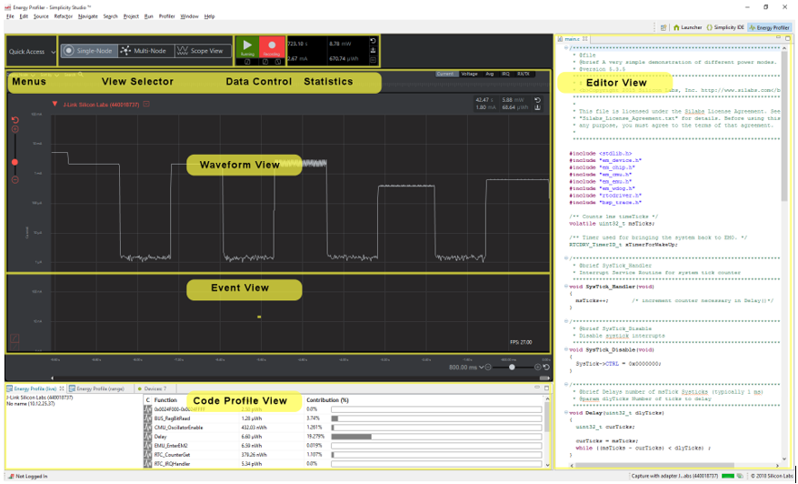

## Low power consumption

### [Power profiler kit](https://www.silabs.com/documents/public/user-guides/ug431-brd4183a-user-guide.pdf)

Kit working with [Energy Profiler](https://docs.silabs.com/simplicity-studio-5-users-guide/1.0/using-the-tools/energy-profiler/) integrated in Simplicity Studio

### Demo

<iframe width="640" height="360" src="https://www.youtube.com/embed/OZZQ3ALdSR8" title="[Power profiler] IOT device low power consumption" frameborder="0" allow="accelerometer; autoplay; clipboard-write; encrypted-media; gyroscope; picture-in-picture" allowfullscreen></iframe>

